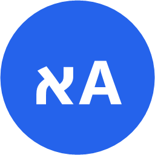

<div align="center">



# Keyboard Fix

**Typed a whole sentence in the wrong keyboard language? Select it, press `Ctrl+CapsLock`, done.**

Hebrew ↔ English layout fixer for Windows — works in every app.

[**⬇ Download the installer**](../../releases/latest) · [**📖 עברית — קראו בעברית**](#hebrew)

</div>

---

```
tbh rumv ahvhv rauo cgcrh   →   אני רוצה שיהיה רשום בעברי
akuo עולם                   →   שלום guko
```

## Features

- **Works everywhere** — Chrome, Word, Excel, WhatsApp, Notepad, VS Code, Windows Terminal, Claude Code… any app you type in.
- **Automatic direction** — every word is flipped on its own: Hebrew words become English, English words become Hebrew, so mixed text is fully swapped.
- **One shortcut: `Ctrl+CapsLock`** — one hand, bottom-left corner, not used by any common app, and it does **not** toggle Caps Lock.
- **Nothing selected?** Inside a text box, the whole box is converted. Outside a text box nothing happens.
- **Floating button** — after selecting text with the mouse inside a text box, a small `אA` button pops up next to the cursor. Click it to convert. It never steals focus from the app you're typing in.
- **Terminals too** — in Windows Terminal / CMD / PowerShell (including Claude Code) the line you just typed is erased and retyped in the other language. Press again to flip it back.
- **Switches your keyboard layout** to the right language after converting, so you can keep typing.
- **Keeps your clipboard** — whatever you had copied is restored, and the temporary text stays out of `Win+V` history.
- **Starts with Windows** in the background (tray icon), with admin rights so it also works inside apps running as Administrator — no UAC prompt at every boot.
- **Tiny, no dependencies** — ~70 KB, uses the .NET Framework that ships with Windows.

## Install

1. Download **`KeyboardFix-Setup.exe`** from the [latest release](../../releases/latest).
2. Run it and approve the admin prompt (needed once, so the app can work inside admin windows too).
3. That's it — the blue `אA` icon appears in the tray.

> Windows SmartScreen may warn about an unknown publisher because the installer isn't code-signed. Click **More info → Run anyway**, or build it yourself from source (below).

**Uninstall:** Settings → Apps → *Keyboard Fix* → Uninstall.

## Usage

| What you want | What you do |
|---|---|
| Fix selected text | Select it, press `Ctrl+CapsLock` |
| Fix a whole text box | Click in the box (nothing selected), press `Ctrl+CapsLock` |
| Fix with the mouse | Select text in a text box → click the `אA` button |
| Fix in a terminal | Right after typing the line, press `Ctrl+CapsLock` (again = undo) |

**Tray menu** (right-click the icon): pause, floating button on/off, start with Windows on/off, edit settings, exit.

**Settings** — `%APPDATA%\KeyboardFix\settings.ini`:

```ini
Hotkey=Ctrl+CapsLock      ; e.g. Ctrl+Shift+D, Alt+Q, Pause, F9
SwitchLayout=true         ; switch the keyboard layout after converting
FloatingButton=true       ; show the floating button after mouse selection
```

After editing, choose **Reload settings** from the tray menu.

## How it works

- **Regular apps:** saves your clipboard → sends `Ctrl+C` → converts by physical key position → pastes with `Ctrl+V` → restores your clipboard.
- **Is there a selection / is this a text box?** Asked through Windows UI Automation (the accessibility API), so the floating button only appears for real selections inside editable fields.
- **Terminals:** `Ctrl+C` would interrupt the running program there, so instead the app remembers the keys typed on the current line (in memory only; cleared on Enter, clicks, arrow keys or switching windows), erases them with Backspace and retypes them in the other language.
- **`Ctrl+CapsLock`** is caught with a low-level keyboard hook and swallowed, so Caps Lock never toggles.

## AI agent skill

Pasted gibberish into Claude, ChatGPT or Cursor? The [`hebrew-keyboard-layout-fix`](skill/hebrew-keyboard-layout-fix) skill teaches AI agents to recognize wrong-layout text (`tbh rumv` → `אני רוצה`) and answer what you actually meant. It includes a zero-dependency Python converter using the same algorithm as the app.

## Build from source

Requires only Windows 10/11 (the C# compiler of .NET Framework 4.x is built in).

```powershell
powershell -ExecutionPolicy Bypass -File build.ps1      # -> bin\KeyboardFix.exe, dist\KeyboardFix-Setup.exe
powershell -ExecutionPolicy Bypass -File install.ps1    # build + install
powershell -ExecutionPolicy Bypass -File tests\test-converter.ps1
```

Debugging: create an empty `%APPDATA%\KeyboardFix\debug.log` and the app will write to it. `KeyboardFix.exe --exit` closes the running instance.

## Limitations

- Supports the standard Hebrew and US English layouts.
- Apps that don't expose their text to Windows accessibility get the floating button only after a mouse drag inside a classic text field.
- In terminals only text typed since the last Enter/click/arrow key can be converted.

## License

[MIT](LICENSE)

---

<div dir="rtl" align="right">

<a id="hebrew"></a>

# Keyboard Fix — בעברית

**הקלדתם משפט שלם בשפה הלא נכונה? מסמנים, לוחצים `Ctrl+CapsLock`, וזה מתוקן.**

תוכנה ל-Windows שמתקנת טקסט שהוקלד בשפת מקלדת לא נכונה (עברית ↔ אנגלית), בכל אפליקציה.

[⬆ Back to English](#keyboard-fix)

## מה היא יודעת לעשות

- **עובדת בכל מקום:** כרום, Word, Excel, WhatsApp, פנקס רשימות, VS Code, טרמינל, Claude Code, וכל תוכנה אחרת שבה כותבים.
- **זיהוי כיוון אוטומטי:** כל מילה מתהפכת בנפרד. מילים בעברית הופכות לאנגלית ומילים באנגלית הופכות לעברית, כך שגם טקסט מעורב מתהפך במלואו.
- **קיצור אחד: `Ctrl+CapsLock`.** לוחצים ביד אחת, בפינה השמאלית של המקלדת. אף תוכנה נפוצה לא משתמשת בו, והוא **לא** מדליק את ה-Caps Lock.
- **בלי סימון:** בתוך תיבת טקסט, כל הטקסט בתיבה מתהפך. מחוץ לתיבת טקסט לא קורה כלום.
- **כפתור צף:** אחרי שמסמנים טקסט בעכבר בתוך תיבת טקסט, קופץ ליד הסמן כפתור קטן `אA`. לחיצה עליו הופכת את הטקסט, בלי להוציא את הפוקוס מהחלון שבו כותבים.
- **גם בטרמינל:** ב-Windows Terminal, CMD ו-PowerShell (כולל Claude Code) השורה שהקלדתם נמחקת ומוקלדת מחדש בשפה השנייה. לחיצה נוספת מחזירה אותה.
- **מחליפה את שפת המקלדת** לשפה הנכונה אחרי ההמרה, כדי שתוכלו להמשיך להקליד.
- **שומרת על לוח ההעתקה:** מה שהעתקתם קודם חוזר ללוח, והטקסט הזמני לא נשמר בהיסטוריית `Win+V`.
- **עולה עם Windows** ורצה ברקע (סמל במגש ליד השעון). היא רצה עם הרשאות מנהל, ולכן עובדת גם בתוכנות שרצות כמנהל, בלי חלון אישור בכל הדלקה.
- **קטנה ובלי תלויות:** כ-70KB, ומשתמשת ב-.NET Framework שכבר מותקן ב-Windows.

## התקנה

1. מורידים את **`KeyboardFix-Setup.exe`** מה-[גרסה האחרונה](../../releases/latest).
2. מריצים ומאשרים את בקשת הרשאות המנהל. זה נדרש פעם אחת בלבד, כדי שהתוכנה תעבוד גם בחלונות שרצים כמנהל.
3. זהו. הסמל הכחול `אA` מופיע במגש.

> ייתכן ש-Windows SmartScreen יציג אזהרה על "מפרסם לא מוכר", כי קובץ ההתקנה לא חתום דיגיטלית. לוחצים **מידע נוסף ← הפעל בכל זאת**, או בונים את התוכנה בעצמכם מהקוד (הוראות למעלה, בחלק האנגלי).

**הסרה:** הגדרות ← אפליקציות ← *Keyboard Fix* ← הסר התקנה.

## שימוש

| מה רוצים | מה עושים |
|---|---|
| לתקן טקסט מסומן | מסמנים ולוחצים `Ctrl+CapsLock` |
| לתקן תיבת טקסט שלמה | לוחצים בתוך התיבה, בלי לסמן, ולוחצים `Ctrl+CapsLock` |
| לתקן עם העכבר | מסמנים טקסט בתיבה ולוחצים על הכפתור `אA` |
| לתקן בטרמינל | מיד אחרי ההקלדה לוחצים `Ctrl+CapsLock`. לחיצה נוספת מבטלת |

**תפריט הסמל** (לחיצה ימנית על הסמל במגש): השהיה, הפעלה וכיבוי של הכפתור הצף, הפעלה עם Windows, עריכת הגדרות, יציאה.

**הגדרות:** בקובץ `%APPDATA%\KeyboardFix\settings.ini` אפשר לשנות את קיצור המקשים, את החלפת השפה האוטומטית ואת הכפתור הצף. אחרי עריכה בוחרים **טען הגדרות מחדש** מתפריט הסמל.

## איך זה עובד

- **בתוכנות רגילות:** התוכנה שומרת את לוח ההעתקה, שולחת `Ctrl+C`, ממירה לפי המיקום הפיזי של המקשים, מדביקה עם `Ctrl+V` ומחזירה את התוכן המקורי ללוח.
- **האם יש טקסט מסומן, והאם זו תיבת טקסט?** התוכנה בודקת את זה דרך UI Automation, ממשק הנגישות של Windows. לכן הכפתור הצף מופיע רק כשבאמת מסומן טקסט בתוך שדה שאפשר לערוך.
- **בטרמינל:** שליחת `Ctrl+C` הייתה עוצרת את התוכנית שרצה. במקום זה התוכנה זוכרת את המקשים שהוקלדו בשורה הנוכחית, מוחקת אותם ב-Backspace ומקלידה אותם מחדש בשפה השנייה. הזיכרון נשמר רק בזיכרון התוכנה, ומתאפס ב-Enter, בלחיצת עכבר, בחיצים או במעבר חלון.

## סקיל לסוכני AI

הדבקתם ג'יבריש ל-Claude, ל-ChatGPT או ל-Cursor? הסקיל [`hebrew-keyboard-layout-fix`](skill/hebrew-keyboard-layout-fix) מלמד סוכני AI לזהות טקסט שהוקלד בשפה הלא נכונה (`tbh rumv` ← `אני רוצה`) ולענות על מה שבאמת התכוונתם. הוא כולל סקריפט Python ללא תלויות, שעובד באותו אלגוריתם כמו התוכנה.

## מגבלות

- התוכנה תומכת בפריסות המקלדת הסטנדרטיות של עברית ואנגלית (ארה"ב).
- בתוכנות שלא חושפות את הטקסט שלהן לממשק הנגישות, הכפתור הצף יופיע רק אחרי סימון בגרירה בתוך שדה טקסט רגיל.
- בטרמינל אפשר להמיר רק טקסט שהוקלד מאז ה-Enter, הלחיצה או החץ האחרונים.

## רישיון

[MIT](LICENSE)

</div>
